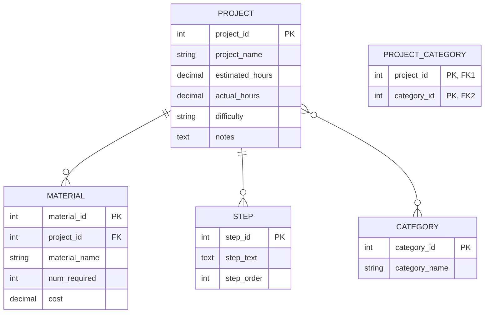

# Week 8 Assignment

Repository for submission for week 8 coding assignment.

## Background

You are in the process of creating an application that will perform CRUD (Create, Read, Update, and Delete) operations on a MySQL database. In the week 7 exercises, you wrote code to connect to a MySQL database using the Java Database Connectivity (JDBC) API. In these exercises, you will diagram the database tables using Draw.io to create an Entity-Relationship Diagram. You will then write the SQL statements to create the five project tables. Lastly, you will use a MySQL client (DBeaver) to create the tables.

## Objectives

In these exercises, you will:

-   Learn how to create an Entity-Relationship Diagram (ERD) in Draw.io with entities and relationship lines.

-   Learn about crows' foot notation and how to apply that knowledge in an Entity Relationship Diagram.

-   Apply your knowledge of `DROP TABLE` and `CREATE TABLE` statements to create tables using a MySQL client (DBeaver),

### Important

In the exercises below, you will see this icon: :camera:. This means to make sure that you include this functionality in your video showcase.

## Exercises

Use the column definitions in the table below for the Entity-Relationship Diagram (ERD) and the `CREATE TABLE` statements.

| Table            | Column            | Data Type    | Nullable | Comment                                    |
| ---------------- | ----------------- | ------------ | :------: | ------------------------------------------ |
| project          | `project_id`      | int          |    No    | primary key                                |
|                  | `project_name`    | varchar(128) |    No    |                                            |
|                  | `estimated_hours` | decimal(7,2) |   Yes    |                                            |
|                  | `actual_hours`    | decimal(7,2) |   Yes    |                                            |
|                  | `difficulty`      | int          |   Yes    |                                            |
|                  | `notes`           | text         |   Yes    |                                            |
|                  |                   |              |          |                                            |
| material         | `material_id`     | int          |    No    | primary key                                |
|                  | `project_id`      | int          |    No    | foreign key                                |
|                  | `material_name`   | varchar(128) |    No    |                                            |
|                  | `num_required`    | int          |   Yes    |                                            |
|                  | `cost`            | decimal(7,2) |   Yes    |                                            |
|                  |                   |              |          |                                            |
| step             | `step_id`         | int          |    No    | primary key                                |
|                  | `project_id`      | int          |    No    | foreign key                                |
|                  | `step_text`       | text         |    No    |                                            |
|                  | `step_order`      | int          |    No    |                                            |
|                  |                   |              |          |                                            |
| category         | `category_id`     | int          |    No    | primary key                                |
|                  | `category_name`   | varchar(128) |    No    |                                            |
|                  |                   |              |          |                                            |
| project_category | `project_id`      | int          |    No    | foreign key, unique key with `category_id` |
|                  | `category_id`     | int          |    No    | foreign key, unique key with `project_id`  |

### Entity-Relationship Diagram

Documenting a project is an essential skill so that the project will make sense to others who want to know about the project. This includes network diagrams, Entity-Relationship Diagrams, well-commented code and `README` files.

In this section, you will create an Entity-Relationship Diagram. This diagram will contain the five table entities and show the relationships between the tables. A good ERD can quickly orient future developers to the data that the application will work with.

Use your knowledge learned in the videos and follow the instructions in this section to create an Entity-Relationship Diagram of the DIY Projects schema.

1. Follow the instructions in the Week 8 Installation Instructions found in the resources packet to either download Draw.io or to use the online tool.

2. In Draw.io, create a new drawing and expand "Entity Relation" in the tool palette on the left.

3. Use Draw.io to create an Entity-Relationship Diagram. Save the file. The file must be uploaded to your GitHub repository for Week 8. Note that it should look similar to the diagram below.



### Project Schema

In this section, you will create a new file and write `DROP TABLE` and `CREATE TABLE` SQL statements for the five tables in the DIY Projects schema. The goal for this section is to copy the SQL statements from the file, drop them into the DBeaver SQL editor, and have DBeaver send the instructions to the MySQL server so that the five tables are created with no errors.

Creating the tables is the first step to having the application read from and write to them. Next week you will begin that process.

1. In the `mysql-java` project in Eclipse, create a file named `projects-schema.sql` in the `src/main/resources` directory.

2. Add `DROP TABLE` statements at the top of the file to drop the tables in the correct order. There can be some variation but the tables with dependencies (foreign key references to other tables) must be dropped first. The tables should only be dropped if they exist.

3. Write the `CREATE TABLE` statements in the inverse of the order that they were dropped. Include the following:

    &emsp;a. Auto-increment the primary key columns.

    &emsp;b. Primary key statements.

    &emsp;c. Foreign key statements with appropriate `ON DELETE CASCADE`.

4. Remember to close each `DROP TABLE` and `CREATE TABLE` statement with a semicolon.

5. Paste the SQL into the DBeaver SQL editor. Run all `DROP TABLE` and `CREATE TABLE` statements. Include your created tables as shown in DBeaver's connection explorer (leftmost panel) in your video. :camera: It should look like this:

    ```
    └─ projects
        ├── Tables
        │   ├─ category
        │   ├─ material
        │   ├─ project
        │   ├─ project_category
        │   └─ step
        ├── Views
        ├── Indexes
        ├── Procedures
        ├── Triggers
        └── Events
    ```

6. Push your project to GitHub.


# Week 7: Coding Assignment Instruction & Submission

Submission for week 7 coding assignment.

### Background

The weekly exercises are designed to augment the video lessons. In the exercises, you will develop a **menu-driven application in Java**. This application will demonstrate how to perform **CRUD** (Create, Read, Update, and Delete) operations on a MySQL database.

You will be working in a **Project schema** (database) that contains do-it-yourself (DIY) projects. A DIY project contains project details, materials, steps, and categories. Below is a diagram of the tables and relationships in the Project schema. Don't worry at this point if you don't understand what the diagram is telling you. This will become clear soon. For now, just know that there are five tables in the Project schema: `project`, `material`, `step`, `category`, and `project_category`. This is the **Entity Relationship Diagram** (ERD) you will build in the week 8 exercises:


There will be a final project in this (MySQL) part of the back-end course. These exercises will help prepare you for that.

## Instructions

Follow the **Exercises** below to complete this assignment.

-   In Eclipse, or an IDE of your choice, write the code that accomplishes the objectives listed below. Ensure that the code compiles and runs as directed.

-   Create a new repository on GitHub for this week's assignment and push your completed code to this dedicated repo, including your entire Maven Project Directory (e.g., mysql-java) and any .sql files that you create. In addition, screenshot your ERD and push the screenshot to your GitHub repo.

-   Include the functionality into your Video when you see.

-   Create a video showcasing your work.

-   In this video: record and present your project verbally while showing the results of the working project. Don't forget to include the requested functionality.

-   **_Easy way to Create a video:_** Start a meeting in Zoom, share your screen, open Eclipse with the code and your Console window, start recording & record yourself describing and running the program showing the results. When you click "End Meeting" it will save the video on your computer.

-   Create a video, up to five minutes max, showing and explaining how your project works with an emphasis on the portions you contributed.

-   This video should be done using screen share and voice over.

-   This should then be uploaded to a publicly accessible site, such as YouTube. Ensure the link you share is PUBLIC or UNLISTED!

-   (If it is not accessible by your grader, your project will be graded based on what they can access.)

## Objectives

In these exercises, you will:

-   Use MySQL Workbench to create a schema and user.

-   Use MySQL Workbench to assign schema privileges to a user.

-   Create a Maven project in Eclipse.

-   Add the MySQL driver as a dependency in `pom.xml` (Maven's Project Object Model – POM).

-   Separate project concerns by creating packages.

-   Write Java code to connect to a MySQL database and schema.

### Important

In the exercises below, you will see an icon of a camera :camera: . This means to make sure that you include this functionality in your video showcase.

## Exercises

In these exercises, you will use MySQL Workbench to create the project schema, as well as a user account. Then, you will create a Maven project. In the project you will write code to connect to the database schema that you created using MySQL Workbench.

### Create the schema with MySQL Workbench

In this section, you will use MySQL Workbench to create the projects schema, which MySQL traditionally and unfortunately also calls a database. You will also create a user with privileges only for that schema. In other words, the user account that you will create can only access the tables in the projects schema and no others. This is a good practice in which a database account is only able to access the data it needs to perform its job. This step will help you accomplish that goal.

1. Open and log into MySQL Workbench.

2. Create a schema named "projects". Include your projects schema. :camera: Your video should include something like this:

    ```
    SCHEMAS
    └─ projects
    ```

3. Create a user named "projects" and assign a password.

4. Add all privileges except "GRANT OPTION". :camera: Show this in your video:

    **Details for account projects@%**

    | Login | Account Limits | Administrative Roles | Schema Privileges |
    | ----- | -------------- | -------------------- | ----------------- |

    | Schema   | Privileges                                                                                   |
    | -------- | -------------------------------------------------------------------------------------------- |
    | projects | ALTER, ALTERR ROUTINE, CREATE, CREATE ROUTINE, CREATE TERMPORARY TABLES, CREATE VIEW, DELETE |

### Create a Maven Project

Maven is a tool that is used to control the building of a Java project. Eclipse comes bundled with an internal version of Maven and the two tools have a tight integration. Maven has lots of features, but we will only be using it to add project dependencies. A project dependency is a library of code packaged as a Java Archive (JAR file). For our DIY project application, there is only one dependency required: the MySQL driver.

To create a new Maven project:

1. Click on the File menu in the top menu bar. Then select "New" / "Project". When the New Project wizard appears, expand "Maven". Select "New Maven Project" and click "Next".

2. Check the box, "Create a simple project (skip archetype selection)". Click "Next".

3. Enter the values in the table below into the fields and click "Finish".

| Field       | Value            |
| ----------- | ---------------- |
| Group ID    | com.promineotech |
| Artifact ID | mysql-java       |
| Version     | 0.0.1-SNAPSHOT   |

### Modify `pom.xml`

Maven knows how to build projects (and provide project dependencies) based on configuration settings in an XML file named `pom.xml`. This file defines what Maven calls the **Project Object Model (POM)**. The file is kept in the project root directory.

In this section, you will add a property with the correct Java version. You will then add the MySQL driver as a project dependency. Then, you will add a plugin that will use the Java version property to set the correct Java version.

In this section you will be working in `pom.xml`.

1. In this step you will add the Java version as a property in the Maven POM. You will **set the value to 17 or 21, not 11,** depending on the Java compiler version you have installed. To add the property:

    &emsp;a. Create a `<properties>` section below the version element and inside the closing </project> tag. Add the closing `</properties>` tag below the opening tag.

    &emsp;b. Inside the properties element, add the child element `<java.version></java.version>`. Inside the `java.version` element, set the version to `17` or `21`, _not_ `11`. It should look like this:

    ```xml
    <properties>
        <java.version>11</java.version>
    </properties>
    ```

2. In this step, you will add the MySQL driver as a dependency in the dependencies section.

    &emsp;a. Below the `<properties>` element, create a new element named `<dependencies>` with the closing tag `</dependencies>` below it.

    &emsp;b. In a browser, navigate to https://mvnrepository.com/. Type "mysql" into the search box and press "Enter".

    &emsp;c. Find "MySQL Connector/J" (most likely the first result) and click the link "mysql-connector-j". Click on the most recent version number link.

    &emsp;d. You will see a page with information about the dependency in a table followed by several tabs and a box with the dependency. Click in the box and the Maven dependency is copied to the clipboard.

    ```xml
    <dependency>
        <groupId>mysql</groupId>
        <artifactId>mysql-connector-java</artifactId>
        <version>8.0.28</version>
    </dependency>
    ```

    &emsp;e. Paste the contents of the clipboard into the `<dependencies>` section in `pom.xml`. The dependencies section should look like this:

    ```xml
    <dependencies>
        <dependency>
            <groupId>mysql</groupId>
            <artifactId>mysql-connector-java</artifactId>
            <version>8.0.28</version>
        </dependency>
    </dependencies>
    ```

3. In this step, you will need to add a section to the POM that tells Eclipse which compiler version to use when compiling your project. This is done by adding a definition for the Maven compiler plugin.

    &emsp;a. In a browser, navigate to the Maven compiler usage page: https://maven.apache.org/plugins/maven-compiler-plugin/usage.html.

    &emsp;b. Find the section "Configuring Your Compiler Plugin". Copy the entire `<build>` section to the clipboard.

    &emsp;c. Paste the clipboard contents into `pom.xml` below the `<dependencies>` section. Replace the XML comment inside the configuration element with a reference to the Java version defined in the properties section. To add a property reference, surround it with `${}`. The section should look like this:

    ```xml
    <build>
        <pluginManagement>
            <plugins>
                <plugin>
                    <groupId>org.apache.maven.plugins</groupId>
                    <artifactId>maven-compiler-plugin</artifactId>
                    <version>3.8.1</version>
                    <configuration>
                        <source>${java.version}</source>
                        <target>${java.version}</target>
                    </configuration>
                </plugin>
            </plugins>
        </pluginManagement>
    </build>
    ```

    _At this point, if you are hopelessly lost, refer to the solutions section below._

4. Show all of your `pom.xml`. :camera:

### Set up the project packages

In this section you will create the project structure by adding some packages. This will all be done in the Package Explorer panel in Eclipse.

1. Create the following packages and subpackages under `src/main/java`. Show the package structure in Package Explorer. :camera:

    &emsp;a. projects

    &emsp;b. projects.dao

    &emsp;c. projects.entity

    &emsp;d. projects.exception

    &emsp;e. projects.service

    Your screen shot should look like this:

    ```
    Package Explorer

    ├─ msql-java
    │ ├─ src/main/java
    │ │ ├─ projects
    │ │ ├─ projects.dao
    │ │ ├─ projects.entity
    │ │ ├─ projects.exception
    └─└─└─ projects.service
    ```

### Create an exception class

In this section you will create an exception class that will be used in the `mysql-java` project. This is an **unchecked exception** that will be used throughout the application. We do this because all of the exceptions thrown by the Java Database Connectivity (JDBC) API classes are checked SQLException objects. In coding the application, you will turn the **checked exceptions** into **unchecked exceptions** to keep your code clean.

In this section, you will create the class `DbException` in the `projects.exception` package.

1.  In the `projects.exception` package, create a class named `DbException`. This class must extend `RuntimeException`. Override the following constructors from the superclass:

    ```java
    public DbException(String message) {}

    public DbException(Throwable cause) {}

    public DbException(String message, Throwable cause) {}
    ```

2.  Be sure to call the matching constructor in the superclass from each constructor in `DbException`. Show the `DbException` class in your video. :camera:

### Create the JDBC connection class

In this section, you will create a class that obtains a JDBC Connection object from the driver manager. When you call `DriverManager.getConnection()`, the driver manager looks up the MySQL driver and loads it. It then establishes a **TCP** connection between the application and a MySQL server. If the connection cannot be made for some reason, the driver manager throws a checked `SQLException`. This is converted to an unchecked exception in a catch block.

Follow these steps to create the JDBC Connection class.

1. Create a class in the `projects.dao` package named `DbConnection`. In the class, create the following constants: `HOST`, `PASSWORD`, `PORT`, `SCHEMA`, and `USER`. Set the constants to the correct values. If you followed the instructions above and created a user in MySQL Workbench, the constants should look like this:

    ```java
    private static String HOST = "localhost";
    private static String PASSWORD = "projects";
    private static int PORT = 3306;
    private static String SCHEMA = "projects";
    private static String USER = "projects";
    ```

2. In the `DbConnection` class, create a method named `getConnection()`. It should be public and static and should return a `java.sql.Connection` object. In the `getConnection()` method:

    &emsp;a. Create a String variable named `uri` that contains the MySQL connection URI.

    &emsp;b. Call `DriverManager` to obtain a connection. Pass the connection string (URI) to `DriverManager.getConnection()`.

    &emsp;c. Surround the call to `DriverManager.getConnection()` with a `try/catch` block. The `catch` block should catch `SQLException`.

    &emsp;d. Print a message to the console (`System.out.println`) if the connection is successful.

    &emsp;e. Print an error message to the console if the connection fails. Throw a `DbException` if the connection fails.

    &emsp;f. Show this entire class. :camera:

### Create the `main` class

Every Java application must have an entry point. This is a class with a `main()` method. In this section, you will create a class with a `main()` method. From the `main()` method you will _temporarily_ call `DbConnection.getConnection()` to test that you can obtain a connection to the MySQL server.

Follow these steps to create the application entry point:

1. Create a class in the projects package named `ProjectsApp`. The class must have a `main()` method.

2. In the `main()` method, call the `DbConnection.getConnection()` method.

Run the Java application. Show your console showing that the connection succeeded. :camera:

### Final touches

Typically, when you push a project to GitHub, you only want to push source code, not built class files or extra configuration files maintained by a tool such as Eclipse. In a Maven project, all built classes are put in subdirectories off of the target directory. So, the target directory should not be pushed to GitHub.

Likewise, Eclipse maintains its project configuration in a directory named `.settings`. This directory should also not be pushed to GitHub.

To exclude files or directories from being pushed to GitHub, put the directory and file names into a file named `.gitignore`. This file must be in the project root directory. Simply put the paths of the files or directories on separate lines in `.gitignore` to tell git to ignore these files or directories.

To ignore files, put the file name relative to the project root. Separate directory names with slashes ("`/`"). To ignore directories, put the directory name on a separate line in `.gitignore` and add a slash ("`/`") on the end.

Follow these steps to instruct git to ignore the `.settings` directory and the target directory.

1. In the root of the Eclipse project, create a file named `.gitignore`. It should contain the following lines:

    ```
    .settings/
    target/
    ```

### Solutions

<details><summary><code>pom.xml</code></summary>

```xml
<project
    xmlns="http://maven.apache.org/POM/4.0.0"
    xmlns:xsi="http://www.w3.org/2001/XMLSchema-instance"
    xsi:schemaLocation="
        http://maven.apache.org/POM/4.0.0
        https://maven.apache.org/xsd/maven-4.0.0.xsd">
    <modelVersion>4.0.0</modelVersion>

    <groupId>com.promineotech</groupId>
    <artifactId>msql-java</artifactId>
    <version>0.0.1-SNAPSHOT</version>

    <properties>
        <java.version>11</java.version>
    </properties>

    <dependencies>
        <dependency>
            <groupId>msql</groupId>
            <artifactId>msql-connector-java</artifactId>
            <version>8.0.27</version>
        </dependency>
    </dependencies>

    <build>
        <pluginManagement>
            <plugins>
                <plugin>
                    <groupId>org.apache.maven.plugins</groupId>
                    <artifactId>maven-compiler-plugin</artifactId>
                    <version>3.8.1</version>
                    <configuration>
                        <source>${java.version}</source>
                        <target>${java.version}</target>
                    </configuration>
                </plugin>
            </plugins>
        </pluginManagement>
    </build>
</project>
```

</details>

<details><summary><code>DbConnection.java</code></summary>

```java
package projects.dao;

import java.sql.Connection;
import java.sql.DriverManager;
import java.sql.SQLException;
import projects.exception.DbException;

public class DbConnection {
    private static String HOST = "localhost";
    private static String PASSWORD = "projects";
    private static int PORT = 3306;
    private static String SCHEMA = "projects";
    private static String USER = "projects";

    public static Connection getConnection() {
        String uri = String.format("jdbc:msql://%s:%d/%s?user=%s&password=%s", HOST, PORT, SCHEMA, USER, PASSWORD);
    }

    try {
        Connection conn = DriverManager.getConnection(uri);
        System.out.println("Connection to schema " + SCHEMA + " is successful.");
        return conn;
    } catch (SQLException) {
        System.out.println("Unable to get connection at " + uri);
        throw new DbException("Unable to get connection at \" + uri");
    }
}
```

</details>

<details><summary><code>ProjectsApp.java</code></summary>

```java
package projects;

/**
 * @author Promineo
 */

public class ProjectsApp {

    /**
     * @param args
     */

    public static void main(String[] args) {
        // code
    }
}
```

</details>

<details><summary><code>.gitignore</code></summary>

```
.settings/
target/
```

</details>

<details><summary><code>DbException.java</code></summary>

```java
package projects.exception;

@SuppressWarnings("serial")
public class DbException extends RuntimeException {

    public DbException(String message) {
        super(message);
    }

    public DbException(Throwable cause) {
        super(cause);
    }

    public DbException(String message, Throwable cause) {
        super(message, cause);
    }
}
```

</details>

### Submission text box format:

**GitHub Repository URL:**

`https://github.com/my_github_user_name/repository_name_here`

**Video URL:** `https://youtu.be/your_video_information_here`
